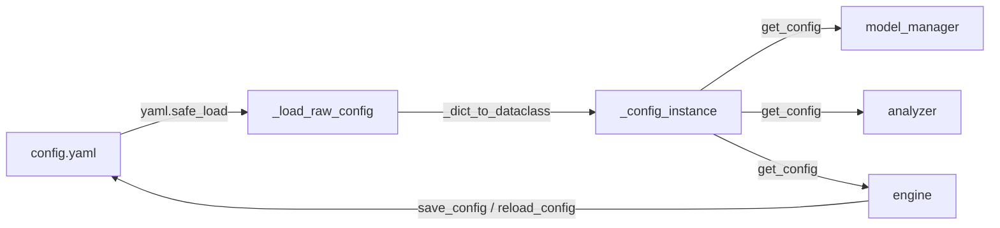

# Kronos 决策模块 (decision/) 代码地图

> 最后更新：2026-07-12
> 本文覆盖 `decision/` 下所有 `.py` 文件和 `config.yaml`，用中文说明各文件的**职责、设计模式、数据流、集成点**。

---

## 目录

- [errors.py — 异常体系](#errorspy--异常体系)
- [config.py + config.yaml — 配置管理](#configpy--configyaml--配置管理)
- [model_manager.py — 模型生命周期管理](#model_managerpy--模型生命周期管理)
- [analyzer.py — 信号分析器](#analyzerpy--信号分析器)
- [engine.py — 决策引擎](#enginepy--决策引擎)
- [模块间调用关系图](#模块间调用关系图)

---

## errors.py — 异常体系

**文件位置**: `decision/errors.py`

### 职责

定义 Kronos 决策系统专用的异常层级，让调用方（engine、WebUI、API）能按异常类型精准捕获和处理，而不是依赖笼统的 `except Exception`。

### 异常层次

```
Exception
 └── KronosError                     # 所有 Kronos 异常的基类
      ├── ConfigError                # 配置参数缺失 / 类型不匹配
      ├── DataSourceError            # 数据源不可用（网络错误、接口异常、限流）
      ├── DataValidationError        # 数据校验失败（格式错误、列缺失、空值过多）
      ├── ModelNotReadyError         # 模型未加载或加载失败
      └── PredictionTimeoutError     # 模型推理超时
```

### 设计模式

- **层级异常模式 (Hierarchical Exception)**：单一根异常 `KronosError` 派生具体子类，调用方可以精确捕获特定异常，也可以统一捕获 `KronosError` 兜底。
- **数据类异常**：每个异常类的文档字符串记录了触发场景，无额外字段，保持轻量。

### 数据流

```
抛出方                                    捕获方
─────────                                ─────────
config.py      ──→ ConfigError          ──→ engine.py (except KronosError)
model_manager  ──→ ModelNotReadyError   ──→ engine.py (except KronosError)
analyzer       ── (暂未抛出)             ──→ engine.py (except KronosError)
data.fetcher   ──→ DataSourceError      ──→ engine.py (except KronosError)
```

### 集成点

- **engine.py**：`predict_and_analyze()` 用 `except KronosError` 捕获所有已知异常，返回 `DecisionReport(status="error")`。
- **config.py**：在配置校验时抛出 `ConfigError`。
- **model_manager.py**：模型加载失败时抛出 `ModelNotReadyError`。
- 扩展方式：新增异常只需继承 `KronosError`，无需修改任何捕获逻辑。

---

## config.py + config.yaml — 配置管理

**文件位置**: `decision/config.py`, `decision/config.yaml`

### 职责

为整个决策模块提供**类型安全的 YAML 配置加载**。所有子模块通过 `get_config()` 获取全局配置单例，避免重复解析文件和硬编码常量。

### 配置结构（`config.yaml`）

```
model:         模型参数（tokenizer/predictor HF 名称、device、max_context、idle_timeout_minutes）
prediction:    预测参数（pred_len、sample_count、temperature、top_p、timeout）
signal:        信号分析阈值（趋势强度买入/卖出阈值、VaR 阈值、RSI 超买超卖）
data:          数据源参数（缓存目录、TTL、重试策略、主/备数据源）
webui:         Web 界面参数（host、port、股票池）
logging:       日志参数（级别、文件路径、轮转大小）
```

### 设计模式

| 模式 | 体现 |
|------|------|
| **单例模式 (Singleton)** | `get_config()` 通过双重检查锁定（DCL）确保全局唯一 `Config` 实例 |
| **数据类 (Dataclass)** | 6 个嵌套的 `@dataclass` 提供类型安全的配置访问（IDE 自动补全 + 编译时检查） |
| **工厂方法** | `_dict_to_dataclass()` 递归将 YAML 字典转换为嵌套 dataclass 实例 |
| **热更新 (Hot Reload)** | `reload_config()` 强制重新读取 YAML 并重建实例，WebUI 调用后无需重启进程 |

### 数据流



### 关键实现细节

1. **双重检查锁定 (DCL)**：
   ```python
   if _config_instance is None:
       with _lock:
           if _config_instance is None:
               raw = _load_raw_config()
               _config_instance = _dict_to_dataclass(Config, raw)
   ```
   - 外层 `if` 避免每次调用都获取锁（性能优化）
   - 内层 `if` 确保线程安全（防止竞态）

2. **递归字典转 dataclass**：
   - `_dict_to_dataclass()` 通过 `typing.get_type_hints()` 获取字段类型
   - 遇到嵌套 dataclass 字段递归转换，基础类型直接赋值

3. **热更新机制**：
   - `reload_config()`：重新读取 YAML → 重建实例（`_lock` 保护）
   - `save_config()`：`dataclasses.asdict()` → `yaml.safe_dump()` 写回文件
   - 调用方无需重启，配置文件变更即时生效

### 集成点

- **所有模块入口**：`get_config()` 是每个子模块初始化时的第一调用。
- **engine.py**：调用 `reload_config()` / `save_config()` 实现 WebUI 设置持久化。
- **性能**：DCL 确保首次加载后 `get_config()` 是 O(1) 且无锁的纯内存读取。

---

## model_manager.py — 模型生命周期管理

**文件位置**: `decision/model_manager.py`

### 职责

管理 Kronos 模型的完整生命周期：**懒加载**（按需加载到 GPU）、**访问跟踪**（记录最后使用时间）、**超时释放**（闲置 N 分钟后释放显存）。目标是确保 GPU 显存在无决策请求时不被长期占用。

### 设计模式

| 模式 | 体现 |
|------|------|
| **懒加载 (Lazy Initialization)** | `get_predictor()` 首次调用时才执行 `_load_model()` |
| **单例 (Singleton)** | `get_model_manager()` 双重检查锁定，全局唯一管理器 |
| **线程安全** | `self._lock` 保护所有状态变更（加载、访问、释放） |
| **定时器释放 (Timer-based Cleanup)** | `threading.Timer` 在每次访问后重新调度，超时自动执行 `_release_gpu()` |

### 生命周期流转

```
                    ┌─────────────────────────────┐
                    │     ModelManager 创建        │
                    │  (predictor=None, tokenizer=None) │
                    └──────────┬──────────────────┘
                               │
                    ┌──────────▼──────────────────┐
                    │ get_predictor() 被调用       │
                    │ _last_access = now           │
                    │ _cancel_cleanup_timer()      │
                    └──────────┬──────────────────┘
                               │
                    ┌──────────▼──────────────────┐
                    │  predictor is None?          │
                    │  → _load_model()             │
                    │    1. 从 HF Hub 加载 tokenizer│
                    │    2. 从 HF Hub 加载 model    │
                    │    3. 包装为 KronosPredictor  │
                    └──────────┬──────────────────┘
                               │
                    ┌──────────▼──────────────────┐
                    │ 返回 (tokenizer, predictor)  │
                    │ _schedule_cleanup()          │
                    │  → N 分钟后触发 _cleanup()   │
                    └──────────┬──────────────────┘
                               │
                    ┌──────────▼──────────────────┐
                    │ 闲置超时 → _cleanup()        │
                    │ → _release_gpu()             │
                    │   1. model.cpu() 释放显存    │
                    │   2. predictor = None         │
                    │   3. tokenizer = None         │
                    └──────────────────────────────┘
```

### 数据流

```
get_model_manager()
  ↓
ModelManager.get_predictor()
  ├─ 缓存命中 → 直接返回 (tokenizer, predictor) 并重置计时器
  └─ 缓存未命中 → _load_model()
       ├─ KronosTokenizer.from_pretrained(tokenizer_name)   ← HuggingFace Hub
       ├─ Kronos.from_pretrained(predictor_name)             ← HuggingFace Hub
       └─ KronosPredictor(model, tokenizer, max_context)
```

### 关键实现细节

1. **空闲超时配置**：通过 `config.yaml` 中 `model.idle_timeout_minutes`（默认 10 分钟）控制。
2. **健康检查**：`is_ready()` 检查 predictor 是否已加载且可用（预留扩展点）。
3. **安全释放**：`_release_gpu()` 中用 `try/except` 保证即使释放出错也不崩溃。

### 集成点

- **engine.py**：唯一调用方，通过 `get_model_manager().get_predictor()` 获取模型。
- **config.py**：读取 `model.*` 配置项决定加载的模型名称、设备、超时时间。
- **errors.py**：加载失败时抛出 `ModelNotReadyError`，engine 捕获后返回 error 状态报告。
- **扩展方式**：如需多模型切换，可直接在 `_load_model()` 中根据配置动态选择 model_name。

---

## analyzer.py — 信号分析器

**文件位置**: `decision/analyzer.py`

### 职责

接收 Kronos 模型的多条预测路径（模拟 Monte Carlo 样条），计算**趋势方向**、**风险评估**和**反转信号**，最后通过**决策矩阵**判定最终的交易信号：`BUY` / `HOLD` / `SELL`。

### 设计模式

| 模式 | 体现 |
|------|------|
| **策略模式 (Strategy)** | 趋势分析、风险评估、反转检测三个子算法可独立替换 |
| **数据类输出 (Dataclass Result)** | `TrendResult` / `RiskResult` / `SignalResult` 作为强类型输出 |
| **决策矩阵 (Decision Matrix)** | `_decide()` 实现规则引擎式的 if-elif 链（6 条规则） |
| **组合模式** | `SignalAnalyzer` 组合三个分析维度生成最终结果 |

### 分析流水线

```
analyze(prediction_paths, current_price, historical_closes)
  │
  ├─ 1. _analyze_trend()
  │    提取各路径末收盘价 → median_price → change_ratio
  │    方向：↑ (change_ratio > 2%) / ↓ (change_ratio < -2%) / → (中间)
  │    强度：abs(change_ratio) × 10 × up_ratio（归一化到 0~1）
  │    一致性：路径间 std/current_price（低 std → "高" 一致性）
  │    → TrendResult(direction, strength, confidence, up_probability)
  │
  ├─ 2. _analyze_risk()
  │    VaR 95%：第 5 百分位价格 vs current_price
  │    波动率：路径 std/current_price 分级（高 > 10% / 中 > 5% / 低）
  │    → RiskResult(var_95, volatility, reversal_risk="中" 默认)
  │
  ├─ 3. _detect_reversal()  [仅当 historical_closes > 30 行]
  │    RSI(14) 计算 → 超买(>70)或超卖(<30) → "高"反转风险
  │    接近超买/超卖 → "中"反转风险
  │    → 更新 risk.reversal_risk
  │
  └─ 4. _decide(trend, risk)  ─── 决策矩阵
```

### 决策矩阵（`_decide()` 6 条规则）

| 优先级 | 条件 | 输出 | 理由 |
|--------|------|------|------|
| 1 (最高) | `VaR 95% < -var_high_threshold` (默认可承受亏损 < -5%) | **SELL** | 风险过大致命 |
| 2 | `strength > buy_threshold` (0.7) + 一致性"高" + 波动非"高" | **BUY** | 强趋势 + 一致 + 低风险 → 买入 |
| 3 | `strength > buy_threshold` + 一致性"高" | **HOLD** | 强趋势 + 一致 + 高风险 → 偏多持有 |
| 4 | `strength > buy_threshold` | **HOLD** | 强趋势 + 低一致（路径分歧大）→ 持有观望 |
| 5 | `strength >= sell_threshold` (0.4) | **HOLD** | 中等趋势 → 持有观望 |
| 6 (最低) | 其余所有 | **SELL** | 弱趋势 → 回避 |

### 数据流

```
输入:
  prediction_paths:  (sample_count, pred_len, n_features)  np.ndarray
  current_price:     float
  historical_closes: np.ndarray (可选)
        │
        ▼
  SignalAnalyzer.analyze()
        │
        ▼
 输出:
  SignalResult {
    signal: "BUY" | "HOLD" | "SELL"
    signal_reason: str
    trend: TrendResult { direction, strength, confidence, up_probability }
    risk:  RiskResult  { var_95, volatility, reversal_risk }
    score_detail: dict
  }
```

### 集成点

- **engine.py**：`DecisionEngine.predict_and_analyze()` 在拿到预测结果后调用 `analyzer.analyze()`。
- **config.py**：读取 `signal.*` 阈值（买入强度、卖出强度、VaR 门限、RSI 门限）。
- **扩展方式**：新增决策规则只需在 `_decide()` 中添加 elif，或修改任意阈值。
- **测试**：`tests/test_analyzer.py` 覆盖各规则路径。

---

## engine.py — 决策引擎

**文件位置**: `decision/engine.py`

### 职责

编排完整的**端到端决策流水线**：数据获取 → 模型预测 → 信号分析 → 决策报告。**不抛出异常**——所有错误都封装在 `DecisionReport` 中返回。

### 设计模式

| 模式 | 体现 |
|------|------|
| **编排器模式 (Orchestrator)** | `predict_and_analyze()` 顺序调用 fetcher → model_manager → analyzer |
| **数据类输出 (Dataclass Result)** | 唯一输出 `DecisionReport`（status / signal / error_message / prediction） |
| **防护性编程 (Defensive)** | `try/except` 结构保证异常不影响后续轮次；`fillna` 兜底数据质量 |
| **静态工厂方法** | `_generate_future_timestamps` / `_simulate_paths` / `_get_stock_name` 作为 `@staticmethod` |

### 流水线（`predict_and_analyze()`）

```
predict_and_analyze(stock_code, params)
  │
  ├─ 1. fetch_daily(stock_code)                    ── DataFetcher
  │    获取 OHLCV DataFrame + stock_name
  │    兜底填充 NaN（fillna(0.0) + dropna(subset=required)）
  │
  ├─ 2. 准备模型输入
  │    取最近 max_context 行
  │    构建 x_df（保留 date 列）、x_timestamp、y_timestamp（跳过周末）
  │
  ├─ 3. model_manager.get_predictor()              ── ModelManager
  │    懒加载 tokenizer + predictor → 执行 Kronos 预测
  │    predict() → 返回 pred_df (pred_len × OHLCVAMT)
  │
  ├─ 4. _simulate_paths(pred_df, n_paths=20)       ── 路径模拟
  │    从单条预测路径 + 5% 噪声生成 20 条采样路径
  │    保证 high ≥ low 物理约束
  │
  ├─ 5. analyzer.analyze(paths, price, closes)     ── SignalAnalyzer
  │    趋势 + 风险 + 反转 → 决策矩阵 → SignalResult
  │
  └─ 6. 返回 DecisionReport(status="ok")
       signal / prediction / elapsed_seconds

  异常路径:
  ├─ KronosError → DecisionReport(status="error", error_message)
  └─ Exception   → DecisionReport(status="error", error_message="未知错误: ...")
```

### DecisionReport 输出格式

```python
@dataclass
class DecisionReport:
    status: Literal["ok", "error", "degraded"]
    error_message: str = ""
    signal: SignalResult | None = None
    prediction: dict | None = None
    stock_code: str = ""
    stock_name: str = ""
    generated_at: str = datetime.now().isoformat()
    elapsed_seconds: float = 0.0
```

### 关键实现细节

1. **永不抛异常**：所有调用方（WebUI、API）只需处理 `DecisionReport`，无需 try/catch 外围层。
2. **计时**：`time.time()` 记录整条流水线耗时，返回 `elapsed_seconds`。
3. **路径模拟**：Kronos `predict()` 返回的是单条平均路径（确定性），analyzer 需要多条路径计算 VaR。`_simulate_paths()` 通过高斯噪声 + 物理约束（high ≥ low）生成合理的模拟路径。
4. **兜底填充**：Kronos 模型要求无 NaN 输入，engine 在数据获取后立即 `fillna` + `dropna`。

### 集成点

| 方向 | 调用的模块 |
|------|-----------|
| 依赖 | `data.fetcher` → `DataFetcher.fetch_daily()` |
| 依赖 | `data.pool` → `get_hs300_pool()`（股票名称查询） |
| 依赖 | `model` → `Kronos`, `KronosTokenizer`, `KronosPredictor`（通过 ModelManager） |
| 依赖 | `decision.analyzer` → `SignalAnalyzer.analyze()` |
| 依赖 | `decision.config` → `get_config()` |
| 依赖 | `decision.errors` → `KronosError`（异常类型判别） |
| 被调用 | WebUI → `engine.predict_and_analyze()` |
| 被调用 | API → `engine.predict_and_analyze()` |

---

## 模块间调用关系图

```
                    ┌─────────────────────────────────────────────────────┐
                    │                    engine.py                        │
                    │              (决策引擎 / Orchestrator)               │
                    └───┬─────────┬──────────┬──────────┬────────────────┘
                        │         │          │          │
           ┌────────────┘         │          │          └─────────────┐
           ▼                      ▼          ▼                        ▼
   ┌──────────────┐    ┌──────────────────┐    ┌──────────────┐  ┌──────────┐
   │ data.fetcher │    │ model_manager.py │    │ analyzer.py  │  │config.py │
   │  (获取行情)   │    │ (模型生命周期)    │    │ (信号分析器)  │  │ (配置)    │
   └──────┬───────┘    └────────┬─────────┘    └──────┬───────┘  └────┬─────┘
          │                     │                      │               │
          ▼                     ▼                      ▼               ▼
   ┌──────────────┐    ┌──────────────────┐    ┌────────────────┐  ┌──────────┐
   │ 外部数据源    │    │ HuggingFace Hub  │    │ 决策矩阵 6 规则 │  │config.yaml│
   │ (akshare/    │    │ (Kronos 模型)     │    │ → BUY/HOLD/SELL│  │          │
   │  baostock)   │    └──────────────────┘    └────────────────┘  └──────────┘
   └──────────────┘
                        ┌──────────────┐
                        │  errors.py   │
                        │ (异常体系)    │
                        └──────────────┘
                         ↑ 被所有模块引用
```

### 数据流摘要

```
外部数据 ──→ DataFetcher ──→ DataFrame
                                  │
                          engine.py (取 max_context 行、准备时间戳)
                                  │
                         ModelManager.get_predictor()
                                  │
                          KronosPredictor.predict()
                                  │
                           pred_df (单条平均路径)
                                  │
                          _simulate_paths() → (20, pred_len, 5)
                                  │
                          SignalAnalyzer.analyze()
                                  │
                          SignalResult { BUY/HOLD/SELL + 理由 }
                                  │
                          DecisionReport (打包)
```

### 配置加载流

```
config.yaml ──→ config.py (_load_raw_config → _dict_to_dataclass → Config)
                    │
          ┌────────┼────────┐
          │        │        │
     engine.py  analyzer  model_manager
          │
    reload_config() / save_config()  ←── WebUI 设置页
```

### 异常流

```
engine.py predict_and_analyze()
  │
  ├─ data.fetcher ──→ DataSourceError ──┐
  ├─ model_manager ──→ ModelNotReadyError ─┤
  ├─ config.py ──→ ConfigError ───────────┤
  └─ 其他 ──→ Exception ──────────────────┤
                                          ▼
                                  DecisionReport(status="error")
```

---

> **编写约定**：本文檔遵循 `codemap.md` 规范，以中文撰写，聚焦 Responsibility / Design Patterns / Data Flow / Integration Points 四个维度。后续开发者可根据此图快速定位代码入口和修改影响范围。
